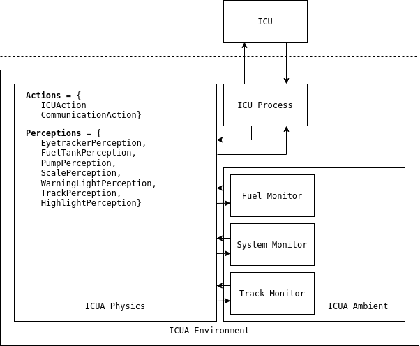

# ICUA
ICU Agents built on top of pystarworlds, an overview of the system is presented below.

## Agents

Three agents each monitor one of the tasks in the ICU system: Fuel, System, Track.

#### Fuel Monitor

Sensors subscribe to: `FuelTankPerception`, `PumpPerception`, `HighlightPerception`, `EyetrackerPerception`

#### System Monitor

Sensors subscribe to: `ScalePerception`, `WarningLightPerception`, `HighlightPerception`, `EyetrackerPerception`

#### Track Monitor

Sensors subscribe to: `TrackPerception`, `HighlightPerception`, `EyetrackerPerception`

All agents subscribe to `HighlightPerceptions`, the agents are able to decide whether to overload the user with warnings or not (i.e. they are aware of all of the warnings currently being displayed).

---------------------------

## Perceptions

Each type of perception mirrors an ICU event (see TODO) for a description of each event. 

* `EyetrackerPerception` - all events that are associated with the eye tracker (gaze, saccade).
* `FuelTankPerception` - all events that are associated with fuel tanks in the fuel monitoring task (burn, fail, repair).
* `PumpPerception` - all events that are associated with pumps in the fuel monitoring task (transfer, click).
* `ScalePerception` - all events that are associated with scales in the system monitoring task (slide, click).
* `WarningLightPerception` - all events that are associated with warning lights in the system monitoring task (switch, click).
* `TrackPerception` - all events thatare associated with the tracking task (move, key).
* `HighlightPerception` - all events that are associated with highlighting, as part of any task (highlight).

## Actions

* `ICUAction` - the action that an agent takes to provide feedback to a user. Takes a similar form to an ICU event `ICUAction(dst, data)` with the source being the agent.
* `CommunicationAction` - the action used to communicate amoung agents in the ICUA system, may be used to corrdinate feedback. 

--------------------------

## Environment

#### ICU Process 

The ICU process is an environmental process - it periodically emits events which are processed by the physics. In ICUA the ICU process connects to the ICU system, receiving all of the events that ICU generates. These events are emited in the form of perceptions by the process, at which point the physics notfies all of the subcribing sensors. The process makes use of a connection to the ICU system which is also used by the physics to send events (`ICUAction`) to the ICU system. 

