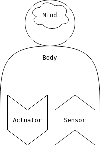

------------------------------
### Latest

- 🆕 A new version of ICUA has been released, see: [GitHub](https://github.com/dicelab-rhul/icua2)

⚠️ This repository is no longer maintained ⚠️ 

------------------------------

# Integrated Cognitive User assistance + Agents

## Install Instructions

### Step 1 (Optional): Create a Python virtual environment

#### Option 1: virtualenv

Navigate to a directory where you want the virtual environment to be located.

##### Windows

```
python3 -m pip install virtualenv
python3 -m venv icu
./icu/Scripts/activate
```

##### Linux / MacOS

```
python3 -m pip install virtualenv
python3 -m venv icu
source icu/bin/activate
```

The virtual environment can be deactivated with `deactivate`.

#### Option 2: Anaconda

Install [Anaconda](https://docs.anaconda.com/anaconda/install/).
```
conda create -n icu python=3.6
conda activate icu
```

The virtual environment can be deactivated with `deactivate`.

### Step 2: Install

```
git clone https://github.com/dicelab-rhul/pystarworlds.git 
pip install -e pystarworlds

git clone https://github.com/dicelab-rhul/ICU.git
pip install -e ICU

git clone https://github.com/dicelab-rhul/ICUA.git
pip install -e ICUA
```

### Step 3: Run
```
python -m icua
```


----------------------------

ICU Agents built on top of [pystarworlds](https://github.com/dicelab-rhul/pystarworlds/tree/master/pystarworlds), an overview of the system is presented below.


## Agents

Three agents each monitor one of the tasks in the ICU system: Fuel, System, Track.




#### Fuel Monitor

Sensors subscribe to: `FuelTankPerception`, `PumpPerception`, `HighlightPerception`, `EyetrackerPerception`

#### System Monitor

Sensors subscribe to: `ScalePerception`, `WarningLightPerception`, `HighlightPerception`, `EyetrackerPerception`

#### Track Monitor

Sensors subscribe to: `TrackPerception`, `HighlightPerception`, `EyetrackerPerception`

All agents subscribe to `HighlightPerceptions`, the agents are able to decide whether to overload the user with warnings or not (i.e. they are aware of all of the warnings currently being displayed). For simplicities sake, each agent has a single sensor and a single actuator.

### Agent Cycle

The agents follow a simple `perceive/revise/decide/attempt` cycle.

* `perceive` - get perceptions from sensors.
* `revise` - revise beliefs given new perceptions.
* `decide` - decide upon actions using Teleoreactive rules, the agent may decide on 0 or more actions per cycle.
* `attempt` - attempt actions using actuators.

---------------------------

## Perceptions

Each type of perception mirrors an ICU event (see TODO) for a description of each event. 

* `EyetrackerPerception` - all events that are associated with the eye tracker (gaze, saccade).
* `FuelTankPerception` - all events that are associated with fuel tanks in the fuel monitoring task (burn, fail, repair).
* `PumpPerception` - all events that are associated with pumps in the fuel monitoring task (transfer, click).
* `ScalePerception` - all events that are associated with scales in the system monitoring task (slide, click).
* `WarningLightPerception` - all events that are associated with warning lights in the system monitoring task (switch, click).
* `TrackPerception` - all events thatare associated with the tracking task (move, key).
* `HighlightPerception` - all events that are associated with highlighting, as part of any task (highlight).

## Actions

* `ICUAction` - the action that an agent takes to provide feedback to a user. Takes a similar form to an ICU event `ICUAction(dst, data)` with the source being the agent.
* `CommunicationAction` - the action used to communicate amoung agents in the ICUA system, may be used to coordinate feedback. 

--------------------------

## Environment

For details on the environment architecture see (pystarworlds)[https://github.com/dicelab-rhul/pystarworlds/tree/master/pystarworld]. A key component of the environment is the ICU process (the connection to the ICU environment), outlined below.

#### ICU Process 

The ICU process is an environmental process - it periodically emits events which are processed by the physics. In ICUA the ICU process is a connection to the ICU system, receiving all of the events that ICU generates. These events are emited in the form of perceptions by the process and the ICUA physics notifies all of the subcribing sensors. Actions (as events) can also be sent from the ICUA (originating from the agents) to ICU, ICU has the capacity to interpret these actions and enact changes on its state. The action events must follow the API exposed by ICU. 
